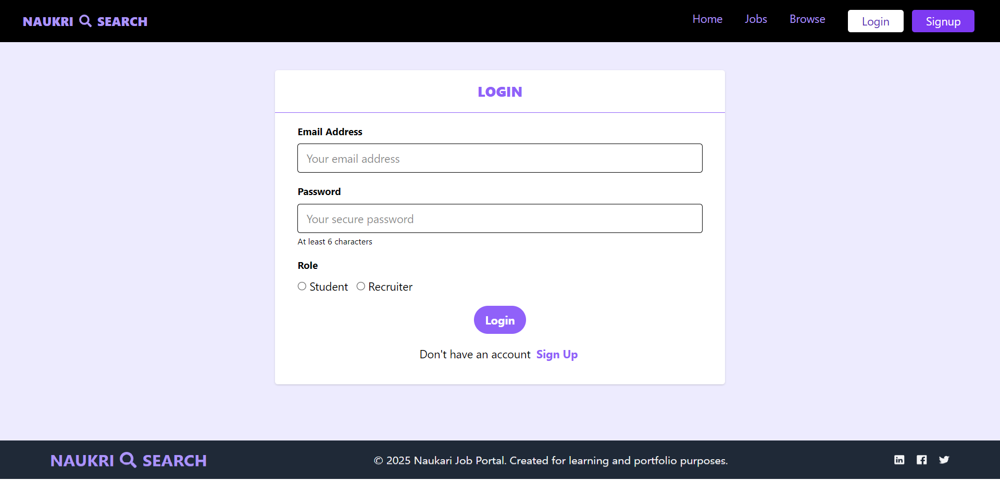
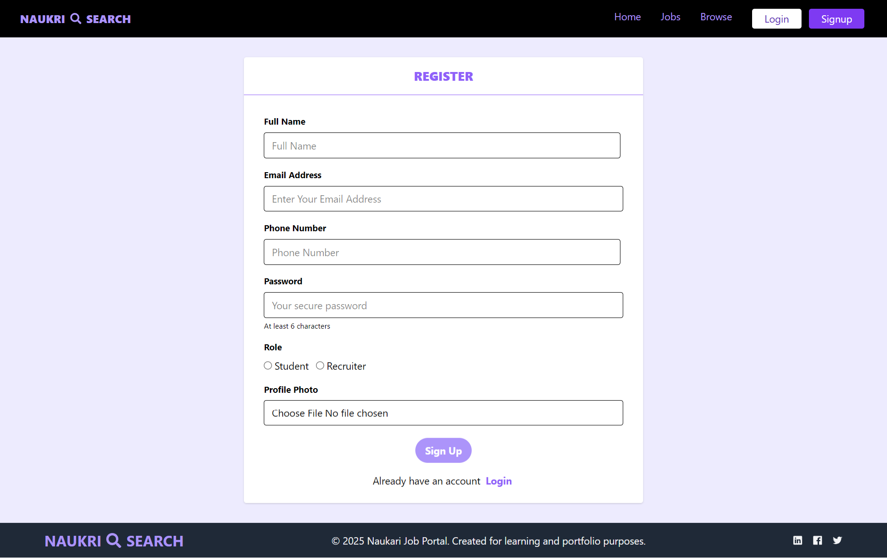
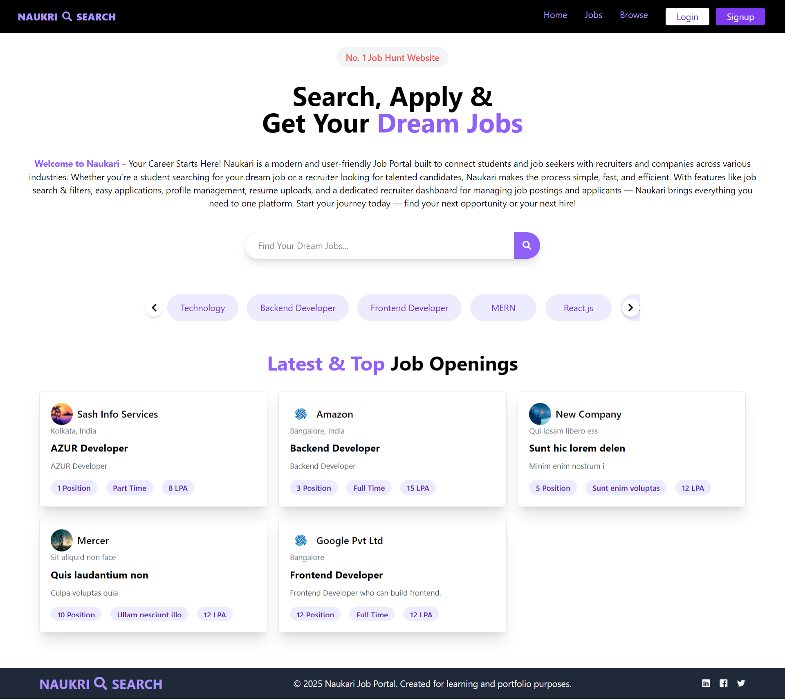
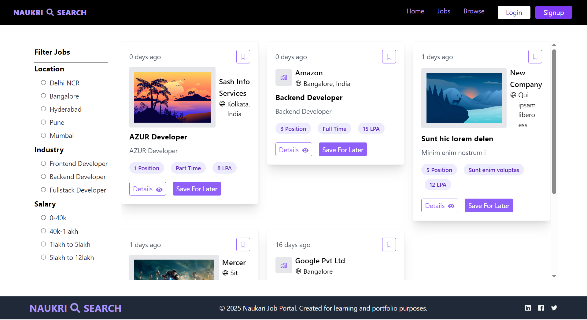
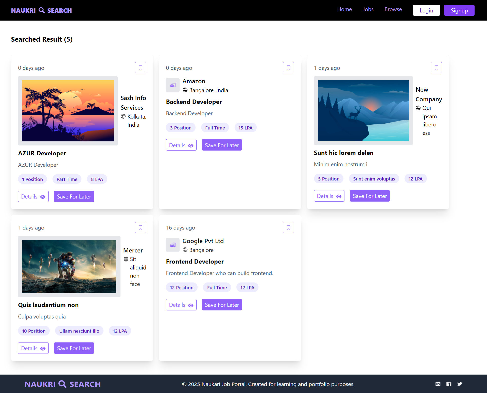
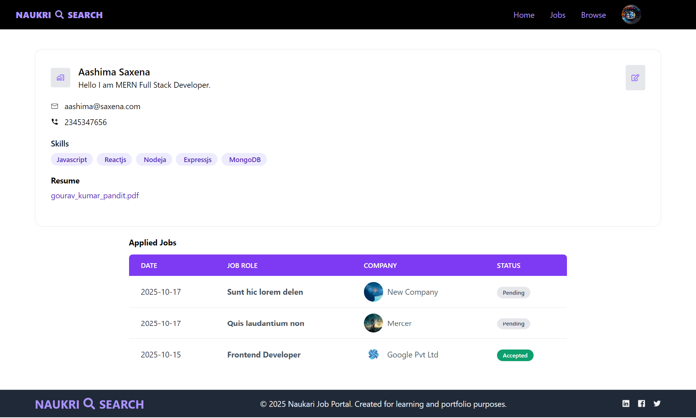
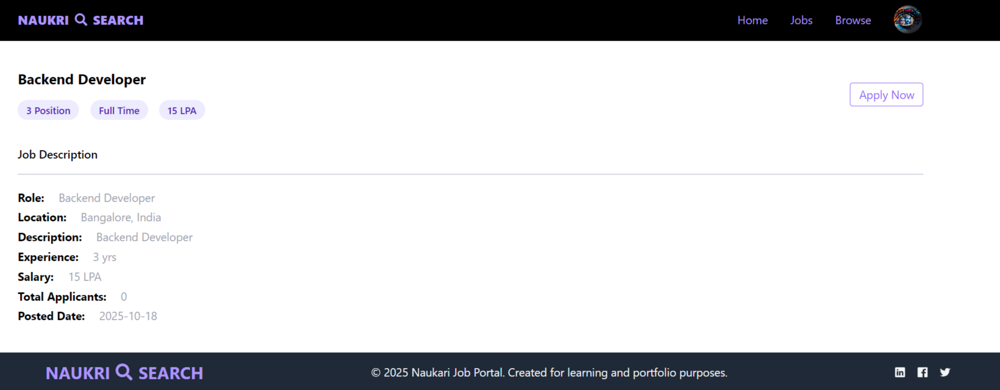
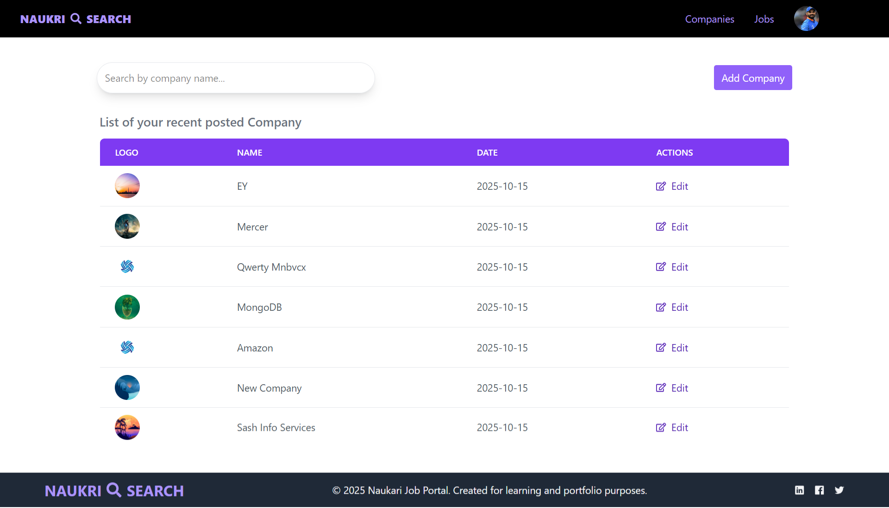

# 🧑‍💼 Job Portal (MERN Stack)

A **Job Portal Application** built using **MERN Stack (MongoDB, Express.js, React.js, Node.js)** with **Redux**, **React Router**, and **Tailwind CSS** for state management, routing, and modern UI styling.

This portal provides **two separate dashboards** for **Students** and **Recruiters**, offering complete functionality to manage jobs, applications, companies, and user profiles.

---

## 🚀 Features

### 👨‍🎓 Student Portal
- 🔐 Signup & Login (JWT Authentication)
- 👁️ View All Jobs & Companies
- 📝 Apply to Jobs
- 📄 Upload Resume & Profile Picture
- 👤 Manage Profile (Name, Skills, Education, etc.)
- 💼 View Applied Jobs
- 🔍 Search & Filter jobs by title, type, or company
- ⚡ Responsive UI built with Tailwind CSS

### 🧑‍💼 Recruiter Portal
- 🔐 Secure Login & Signup
- 🏢 Create and Manage Companies
- 💼 Post New Jobs
- 👁️ View Applicants for a Job
- ✏️ Update Application Status (Accepted / Rejected / Pending)
- 🗂️ Manage All Job Listings
- 📊 Filter Applicants & Jobs

---

## 🧰 Tech Stack

| Category | Technology Used |
|-----------|------------------|
| **Frontend** | React.js, Redux, React Router, Tailwind CSS, Vite |
| **Backend** | Node.js, Express.js |
| **Database** | MongoDB (Mongoose ODM) |
| **Authentication** | JWT (JSON Web Token), Cookies |
| **Storage** | Cloudinary (for file uploads like resume & profile image) |
| **State Management** | Redux Toolkit |
| **UI Styling** | Tailwind CSS |
| **Routing** | React Router DOM |

---

## 🖼️ Screenshots

### 🔹 Login Page


### 🔹 Register Page


### 🔹 Home Page


### 🔹 Jobs Page


### 🔹 Browse Page


### 🔹 Student Profile


### 🔹 Student Job Apply


### 🔹 Recruiter Company Page


### 🔹 Recruiter Applicants Page


### 🔹 Recruiter Job Page


---

## ⚙️ Installation and Setup

### 1️⃣ Clone the Repository
```bash
git clone https://github.com/GouravKumarPandit/Job-Portal.git
cd jobportal
```

### 2️⃣ Setup the Backend
```bash
cd backend
npm install
```

Create a `.env` file in the `backend` folder and add:
```env
PORT=5000
MONGO_URI=your_mongodb_connection_string
JWT_SECRET=your_jwt_secret
CLOUDINARY_CLOUD_NAME=your_cloud_name
CLOUDINARY_API_KEY=your_api_key
CLOUDINARY_API_SECRET=your_api_secret
```

Then run:
```bash
npm run dev
```

### 3️⃣ Setup the Frontend
```bash
cd ../frontend
npm install
npm run dev
```

Frontend will start on:
```
http://localhost:5173
```
Backend will start on:
```
http://localhost:5000
```

---

## 🗂️ Folder Structure

```
jobportal/
├── backend/
│   ├── controllers/
│   ├── models/
│   ├── routes/
│   ├── middlewares/
│   ├── utils/
│   └── server.js
├── frontend/
│   ├── src/
│   │   ├── components/
│   │   ├── pages/
│   │   ├── redux/
│   │   ├── hooks/
│   │   ├── App.jsx
│   │   └── main.jsx
│   └── index.html
├── .env
├── package.json
└── README.md
```

---

## 💡 Future Enhancements

- 🔔 Real-time notifications for job status updates  
- 📧 Email notifications for new applications  
- 🌐 Role-based access control (RBAC) improvements  
- 📱 Mobile app version with React Native  

---

## 🤝 Contributing

Contributions, issues, and feature requests are welcome!  
Feel free to fork this repo and submit a pull request.

---

## 🧑‍💻 Author

**Gourav Kumar Pandit**  
🔗 [GitHub](https://github.com/GouravKumarPandit)  
💼 [LinkedIn](https://www.linkedin.com/in/gourav-kumar-pandit-533334218/)